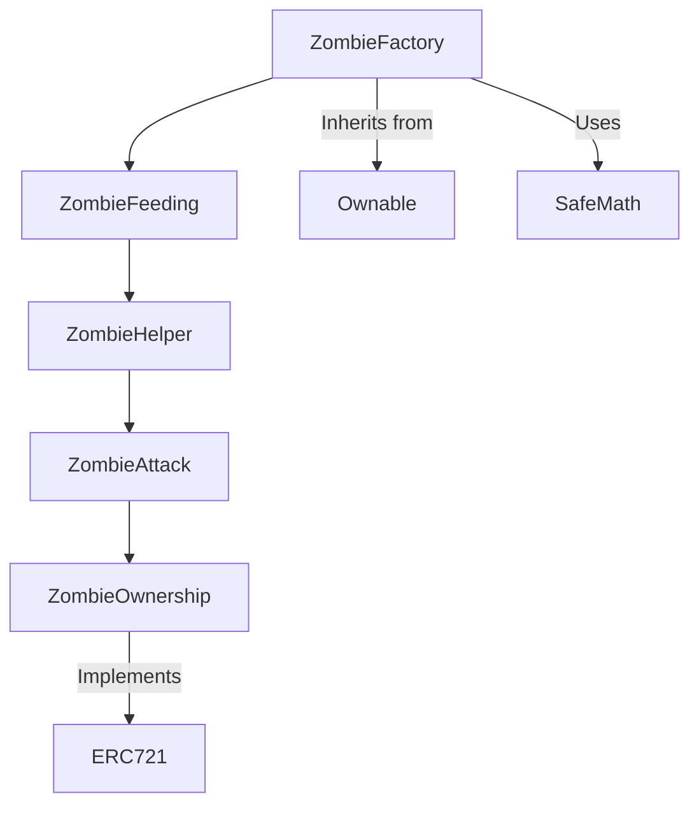

# CryptoZombie_Ethereum_Smart_Contracts

# Ethereum Smart Contract Project: Blockchain Game

## Overview 🌐
This project shows how to build a working app on the Ethereum blockchain, where we created smart contracts that handle digital items users can own, trade, and interact with.

## Contract Architecture 🏗️

## Key Technical Features 💡
- **Blockchain Storage**: Keeping data permanently on Ethereum 📊
- **Smart Contract Talking**: Making different contracts work together 🔄
- **Random Number Creation**: Creating somewhat random outcomes for gameplay 🎲
- **Payment System**: Letting users send ETH to perform actions 💰
- **Digital Collectibles**: Making unique tokens users truly own (NFTs) 🪙

## What I Learned About Ethereum 🛠️
- How to build contracts that connect to each other
- Setting permissions for who can run which functions
- Making code efficient to save on gas fees
- Handling ETH payments in smart contracts
- Sending updates from the blockchain to a website
- Preventing math errors that could break my contract
- Creating digital items that follow the NFT standard

## Connecting to the Web 🌉
Created a website that connects to my smart contracts using Web3.js, allowing users to:
- Connect their Ethereum wallet
- See their digital items
- Make transactions on the blockchain
- Get updates when blockchain events happen

---

*This project was built by the CryptoZombies course, which teaches Ethereum development through creating a blockchain game.*